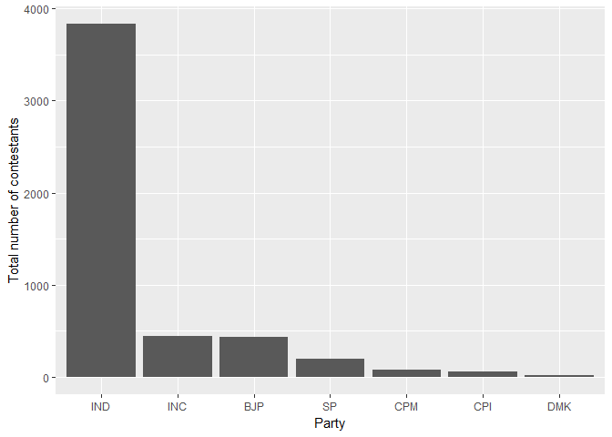
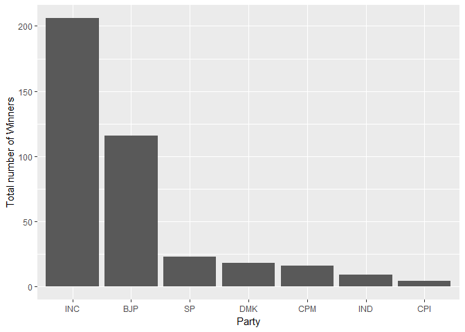
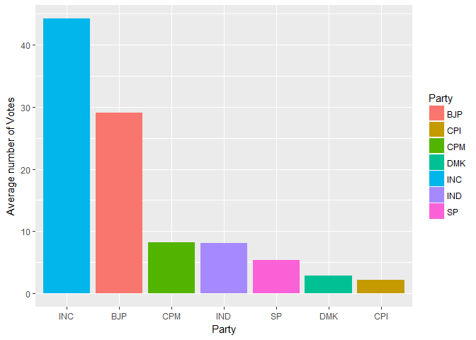
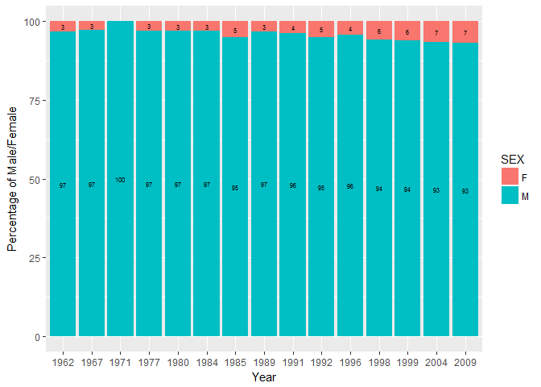
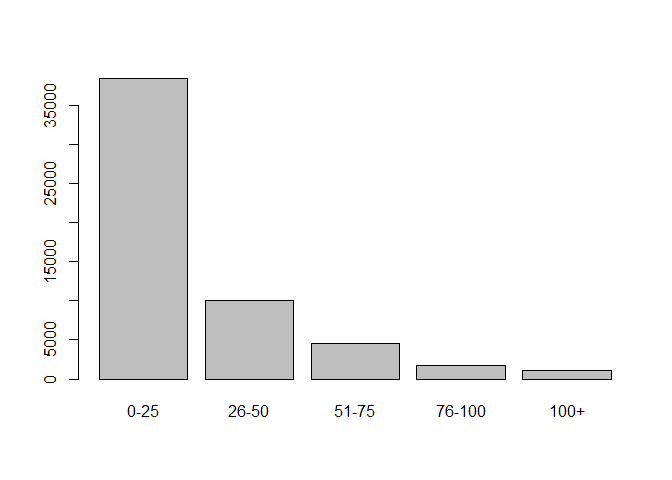
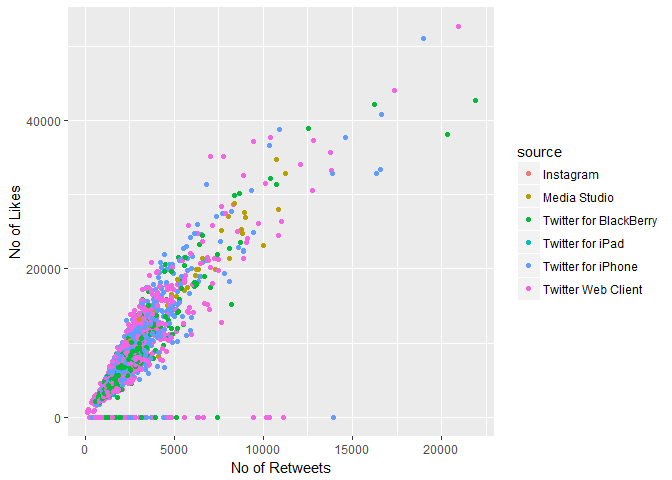

# Parliament-data-analysis---
title: "Parliament Data analysis"
author: "Archit Rao"
date: "29 November 2017"
output: 
  html_document:
    keep_md: true
---

#1. For top ten parties compute the following metrics for the year 2009
	

```r
parliament<-read.csv("C:/Users/Administrator/Desktop/Data visualisation/parliament.csv")

Top_Ten_Parties<-parliament%>%filter(Position==1)%>%group_by(PARTY)%>%summarise(Winners=n())%>%arrange(desc(Winners))%>%head(10)

#a) Total number of contestants

contestents<-parliament%>%filter(YEAR==2009 & PARTY %in% Top_Ten_Parties$PARTY)%>%group_by(PARTY)%>%summarise(No_of_contestants=n())%>%arrange(-No_of_contestants)

ggplot(contestents,aes(x=reorder(PARTY,-No_of_contestants),No_of_contestants))+geom_bar(stat="identity")+ xlab("Party") + ylab("Total number of contestants")
```

<!-- -->

```r
#b) Total of number of winning seats
Winning_Seats<-parliament%>%filter(YEAR==2009 & PARTY %in% Top_Ten_Parties$PARTY & Position==1)%>%group_by(PARTY)%>% summarise(No_of_Winners=n())%>%arrange(-No_of_Winners)

ggplot(Winning_Seats,aes(x=reorder(PARTY,-No_of_Winners),No_of_Winners))+geom_bar(stat="identity")+ xlab("Party") + ylab("Total number of Winners")
```

<!-- -->

```r
#c) Avg. %of votes
total_votes = parliament %>% filter(YEAR == 2009, PARTY %in% Top_Ten_Parties$PARTY) %>% summarise(tot_votes = sum(VOTES))

avgvotes = parliament %>% filter(YEAR == 2009, PARTY %in% Top_Ten_Parties$PARTY) %>% group_by(PARTY) %>% summarise(av_votes = sum(VOTES)/total_votes$tot_votes*100)

ggplot(avgvotes, aes(x = reorder(PARTY, -av_votes), y = av_votes, fill = as.factor(PARTY))) + geom_bar(stat = "identity") + scale_fill_discrete(name = "Party") + xlab("Party") + ylab("Average number of Votes")
```

<!-- -->

```r
#d) Identify top ten candidates with highest %margin of votes for the year 2009
tot_votes_pc<-parliament%>%filter(YEAR==2009)%>%group_by(STATE,PC)%>%summarise(totalvotes=sum(VOTES))
first_pos<-parliament%>%filter(YEAR==2009 & Position %in% c(1,2))%>%group_by(PC)%>%mutate(difference=c(-diff(VOTES),NA))%>%na.omit()
Magin<-merge(first_pos,tot_votes_pc,by="PC")
Margin<-Magin%>%mutate(mar=difference/totalvotes*100)%>%select(PC,NAME,PARTY,mar)%>%arrange(-mar)%>%head(10)

ggplotly(ggplot(Margin,aes(reorder(NAME,-mar),mar))+geom_bar(stat='identity') + xlab("Candidate Name") + ylab("Margin Percentage"))
```

```
## We recommend that you use the dev version of ggplot2 with `ggplotly()`
## Install it with: `devtools::install_github('hadley/ggplot2')`
```

<!--html_preserve--><div id="14482b3334ba" style="width:672px;height:480px;" class="plotly html-widget"></div>
<script type="application/json" data-for="14482b3334ba">{"x":{"data":[{"orientation":"v","width":[0.9,0.9,0.9,0.9,0.9,0.9,0.9,0.899999999999999,0.899999999999999,0.899999999999999],"base":[0,0,0,0,0,0,0,0,0,0],"x":[1,2,3,4,5,6,7,8,9,10],"y":[70.0996892801657,57.2485888811567,55.8263131367678,53.3224870652271,45.8867812459131,40.6036141529807,38.4306550247908,36.5135834411384,36.4313300989658,36.0032595032303],"text":["reorder(NAME, -mar): SUSHMA SWARAJ<br />mar: 70.09969","reorder(NAME, -mar): RAHUL GANDHI<br />mar: 57.24859","reorder(NAME, -mar): SONIA GANDHI<br />mar: 55.82631","reorder(NAME, -mar): DEEPENDER SINGH<br />mar: 53.32249","reorder(NAME, -mar): SUPRIYA SULE<br />mar: 45.88678","reorder(NAME, -mar): C.M. CHANG<br />mar: 40.60361","reorder(NAME, -mar): JYOTIRADITYA MADHAVRAO SCINDIA<br />mar: 38.43066","reorder(NAME, -mar): LALUBHAI PATEL<br />mar: 36.51358","reorder(NAME, -mar): BHONSLE SHRIMANT CHH. UDYANRAJE PRATAPSINHMAHARAJ<br />mar: 36.43133","reorder(NAME, -mar): BAJU BAN RIYAN<br />mar: 36.00326"],"type":"bar","marker":{"autocolorscale":false,"color":"rgba(89,89,89,1)","line":{"width":1.88976377952756,"color":"transparent"}},"showlegend":false,"xaxis":"x","yaxis":"y","hoverinfo":"text","frame":null}],"layout":{"margin":{"t":26.2283105022831,"r":7.30593607305936,"b":40.1826484018265,"l":37.2602739726027},"plot_bgcolor":"rgba(235,235,235,1)","paper_bgcolor":"rgba(255,255,255,1)","font":{"color":"rgba(0,0,0,1)","family":"","size":14.6118721461187},"xaxis":{"domain":[0,1],"type":"linear","autorange":false,"tickmode":"array","range":[0.4,10.6],"ticktext":["SUSHMA SWARAJ","RAHUL GANDHI","SONIA GANDHI","DEEPENDER SINGH","SUPRIYA SULE","C.M. CHANG","JYOTIRADITYA MADHAVRAO SCINDIA","LALUBHAI PATEL","BHONSLE SHRIMANT CHH. UDYANRAJE PRATAPSINHMAHARAJ","BAJU BAN RIYAN"],"tickvals":[1,2,3,4,5,6,7,8,9,10],"ticks":"outside","tickcolor":"rgba(51,51,51,1)","ticklen":3.65296803652968,"tickwidth":0.66417600664176,"showticklabels":true,"tickfont":{"color":"rgba(77,77,77,1)","family":"","size":11.689497716895},"tickangle":-0,"showline":false,"linecolor":null,"linewidth":0,"showgrid":true,"gridcolor":"rgba(255,255,255,1)","gridwidth":0.66417600664176,"zeroline":false,"anchor":"y","title":"Candidate Name","titlefont":{"color":"rgba(0,0,0,1)","family":"","size":14.6118721461187},"hoverformat":".2f"},"yaxis":{"domain":[0,1],"type":"linear","autorange":false,"tickmode":"array","range":[-3.50498446400829,73.604673744174],"ticktext":["0","20","40","60"],"tickvals":[0,20,40,60],"ticks":"outside","tickcolor":"rgba(51,51,51,1)","ticklen":3.65296803652968,"tickwidth":0.66417600664176,"showticklabels":true,"tickfont":{"color":"rgba(77,77,77,1)","family":"","size":11.689497716895},"tickangle":-0,"showline":false,"linecolor":null,"linewidth":0,"showgrid":true,"gridcolor":"rgba(255,255,255,1)","gridwidth":0.66417600664176,"zeroline":false,"anchor":"x","title":"Margin Percentage","titlefont":{"color":"rgba(0,0,0,1)","family":"","size":14.6118721461187},"hoverformat":".2f"},"shapes":[{"type":"rect","fillcolor":null,"line":{"color":null,"width":0,"linetype":[]},"yref":"paper","xref":"paper","x0":0,"x1":1,"y0":0,"y1":1}],"showlegend":false,"legend":{"bgcolor":"rgba(255,255,255,1)","bordercolor":"transparent","borderwidth":1.88976377952756,"font":{"color":"rgba(0,0,0,1)","family":"","size":11.689497716895}},"barmode":"stack","hovermode":"closest"},"source":"A","attrs":{"144871c6723":{"x":{},"y":{},"type":"ggplotly"}},"cur_data":"144871c6723","visdat":{"144871c6723":["function (y) ","x"]},"config":{"modeBarButtonsToAdd":[{"name":"Collaborate","icon":{"width":1000,"ascent":500,"descent":-50,"path":"M487 375c7-10 9-23 5-36l-79-259c-3-12-11-23-22-31-11-8-22-12-35-12l-263 0c-15 0-29 5-43 15-13 10-23 23-28 37-5 13-5 25-1 37 0 0 0 3 1 7 1 5 1 8 1 11 0 2 0 4-1 6 0 3-1 5-1 6 1 2 2 4 3 6 1 2 2 4 4 6 2 3 4 5 5 7 5 7 9 16 13 26 4 10 7 19 9 26 0 2 0 5 0 9-1 4-1 6 0 8 0 2 2 5 4 8 3 3 5 5 5 7 4 6 8 15 12 26 4 11 7 19 7 26 1 1 0 4 0 9-1 4-1 7 0 8 1 2 3 5 6 8 4 4 6 6 6 7 4 5 8 13 13 24 4 11 7 20 7 28 1 1 0 4 0 7-1 3-1 6-1 7 0 2 1 4 3 6 1 1 3 4 5 6 2 3 3 5 5 6 1 2 3 5 4 9 2 3 3 7 5 10 1 3 2 6 4 10 2 4 4 7 6 9 2 3 4 5 7 7 3 2 7 3 11 3 3 0 8 0 13-1l0-1c7 2 12 2 14 2l218 0c14 0 25-5 32-16 8-10 10-23 6-37l-79-259c-7-22-13-37-20-43-7-7-19-10-37-10l-248 0c-5 0-9-2-11-5-2-3-2-7 0-12 4-13 18-20 41-20l264 0c5 0 10 2 16 5 5 3 8 6 10 11l85 282c2 5 2 10 2 17 7-3 13-7 17-13z m-304 0c-1-3-1-5 0-7 1-1 3-2 6-2l174 0c2 0 4 1 7 2 2 2 4 4 5 7l6 18c0 3 0 5-1 7-1 1-3 2-6 2l-173 0c-3 0-5-1-8-2-2-2-4-4-4-7z m-24-73c-1-3-1-5 0-7 2-2 3-2 6-2l174 0c2 0 5 0 7 2 3 2 4 4 5 7l6 18c1 2 0 5-1 6-1 2-3 3-5 3l-174 0c-3 0-5-1-7-3-3-1-4-4-5-6z"},"click":"function(gd) { \n        // is this being viewed in RStudio?\n        if (location.search == '?viewer_pane=1') {\n          alert('To learn about plotly for collaboration, visit:\\n https://cpsievert.github.io/plotly_book/plot-ly-for-collaboration.html');\n        } else {\n          window.open('https://cpsievert.github.io/plotly_book/plot-ly-for-collaboration.html', '_blank');\n        }\n      }"}],"cloud":false},"highlight":{"on":"plotly_click","persistent":false,"dynamic":false,"selectize":false,"opacityDim":0.2,"selected":{"opacity":1}},"base_url":"https://plot.ly"},"evals":["config.modeBarButtonsToAdd.0.click"],"jsHooks":{"render":[{"code":"function(el, x) { var ctConfig = crosstalk.var('plotlyCrosstalkOpts').set({\"on\":\"plotly_click\",\"persistent\":false,\"dynamic\":false,\"selectize\":false,\"opacityDim\":0.2,\"selected\":{\"opacity\":1}}); }","data":null}]}}</script><!--/html_preserve-->

2. Identify year wise percentage of male and female candidates?
<!-- -->

3. Create a new column by binning the Runs column using the following ranges and plot the frequency count of ranges
0-25, 26-50, 51-75, 76-100, 100+


```r
odi<-read.csv("C:/Users/Administrator/Desktop/Data visualisation/odi-batting.csv")

odi$Runs_Range<-cut(odi$Runs,breaks=c(-1,25,50,75,100,Inf),labels = c("0-25", "26-50", "51-75", "76-100","100+"))

plot(as.factor(odi$Runs_Range))
```

<!-- -->


4. Consider the top ten players by total runs and compute and visualize the number of centuries across years (use facet_grid or facet_wrap)


```
## We recommend that you use the dev version of ggplot2 with `ggplotly()`
## Install it with: `devtools::install_github('hadley/ggplot2')`
```

```
## Warning: Removed 1 rows containing missing values (position_stack).
```

<!--html_preserve--><div id="144863c714be" style="width:672px;height:480px;" class="plotly html-widget"></div>
<script type="application/json" data-for="144863c714be">{"x":{"data":[{"orientation":"v","width":[0.9,0.9,0.9,0.9,0.9,0.9,0.899999999999999,0.899999999999999,0.899999999999999,0.899999999999999,0.899999999999999,0.899999999999999,0.899999999999999,0.899999999999999,0.899999999999999,0.899999999999999,0.899999999999999,0.899999999999999],"base":[0,0,0,0,0,0,0,0,0,0,0,0,0,0,0,0,0,0],"x":[2,3,4,5,6,7,8,9,10,11,12,13,14,15,16,17,18,19],"y":[0,0,0,4,0,2,3,2,1,1,0,1,1,3,0,1,0,0],"text":["Year: 1990<br />No_cent: 0","Year: 1991<br />No_cent: 0","Year: 1992<br />No_cent: 0","Year: 1993<br />No_cent: 4","Year: 1994<br />No_cent: 0","Year: 1995<br />No_cent: 2","Year: 1996<br />No_cent: 3","Year: 1997<br />No_cent: 2","Year: 1998<br />No_cent: 1","Year: 1999<br />No_cent: 1","Year: 2000<br />No_cent: 0","Year: 2001<br />No_cent: 1","Year: 2002<br />No_cent: 1","Year: 2003<br />No_cent: 3","Year: 2004<br />No_cent: 0","Year: 2005<br />No_cent: 1","Year: 2006<br />No_cent: 0","Year: 2007<br />No_cent: 0"],"type":"bar","marker":{"autocolorscale":false,"color":"rgba(89,89,89,1)","line":{"width":1.88976377952756,"color":"transparent"}},"showlegend":false,"xaxis":"x","yaxis":"y","hoverinfo":"text","frame":null},{"orientation":"v","width":[0.899999999999999,0.899999999999999,0.899999999999999,0.899999999999999,0.899999999999999,0.899999999999999,0.899999999999999,0.899999999999999,0.899999999999999,0.899999999999999,0.899999999999999,0.899999999999999,0.899999999999999,0.899999999999999],"base":[0,0,0,0,0,0,0,0,0,0,0,0,0,0],"x":[10,11,12,13,14,15,16,17,18,19,20,21,22,23],"y":[0,2,1,3,0,0,0,0,2,2,0,1,1,3],"text":["Year: 1998<br />No_cent: 0","Year: 1999<br />No_cent: 2","Year: 2000<br />No_cent: 1","Year: 2001<br />No_cent: 3","Year: 2002<br />No_cent: 0","Year: 2003<br />No_cent: 0","Year: 2004<br />No_cent: 0","Year: 2005<br />No_cent: 0","Year: 2006<br />No_cent: 2","Year: 2007<br />No_cent: 2","Year: 2008<br />No_cent: 0","Year: 2009<br />No_cent: 1","Year: 2010<br />No_cent: 1","Year: 2011<br />No_cent: 3"],"type":"bar","marker":{"autocolorscale":false,"color":"rgba(89,89,89,1)","line":{"width":1.88976377952756,"color":"transparent"}},"showlegend":false,"xaxis":"x2","yaxis":"y","hoverinfo":"text","frame":null},{"orientation":"v","width":[0.9,0.9,0.9,0.9,0.9,0.899999999999999,0.899999999999999,0.899999999999999,0.899999999999999,0.899999999999999,0.899999999999999,0.899999999999999,0.899999999999999,0.899999999999999,0.899999999999999,0.899999999999999],"base":[0,0,0,0,0,0,0,0,0,0,0,0,0,0,0,0],"x":[3,4,5,6,7,8,10,11,12,13,14,15,16,17,18,19],"y":[0,2,0,1,1,0,1,1,1,1,0,0,2,0,0,0],"text":["Year: 1991<br />No_cent: 0","Year: 1992<br />No_cent: 2","Year: 1993<br />No_cent: 0","Year: 1994<br />No_cent: 1","Year: 1995<br />No_cent: 1","Year: 1996<br />No_cent: 0","Year: 1998<br />No_cent: 1","Year: 1999<br />No_cent: 1","Year: 2000<br />No_cent: 1","Year: 2001<br />No_cent: 1","Year: 2002<br />No_cent: 0","Year: 2003<br />No_cent: 0","Year: 2004<br />No_cent: 2","Year: 2005<br />No_cent: 0","Year: 2006<br />No_cent: 0","Year: 2007<br />No_cent: 0"],"type":"bar","marker":{"autocolorscale":false,"color":"rgba(89,89,89,1)","line":{"width":1.88976377952756,"color":"transparent"}},"showlegend":false,"xaxis":"x3","yaxis":"y","hoverinfo":"text","frame":null},{"orientation":"v","width":[0.899999999999999,0.899999999999999,0.899999999999999,0.899999999999999,0.899999999999999,0.899999999999999,0.899999999999999,0.899999999999999,0.899999999999999,0.899999999999999,0.899999999999999,0.899999999999999,0.899999999999999,0.899999999999999,0.899999999999999,0.899999999999999],"base":[0,0,0,0,0,0,0,0,0,0,0,0,0,0,0,0],"x":[8,9,10,11,12,13,14,15,16,17,18,19,20,21,22,23],"y":[0,0,3,2,0,2,1,2,3,0,1,1,1,0,1,0],"text":["Year: 1996<br />No_cent: 0","Year: 1997<br />No_cent: 0","Year: 1998<br />No_cent: 3","Year: 1999<br />No_cent: 2","Year: 2000<br />No_cent: 0","Year: 2001<br />No_cent: 2","Year: 2002<br />No_cent: 1","Year: 2003<br />No_cent: 2","Year: 2004<br />No_cent: 3","Year: 2005<br />No_cent: 0","Year: 2006<br />No_cent: 1","Year: 2007<br />No_cent: 1","Year: 2008<br />No_cent: 1","Year: 2009<br />No_cent: 0","Year: 2010<br />No_cent: 1","Year: 2011<br />No_cent: 0"],"type":"bar","marker":{"autocolorscale":false,"color":"rgba(89,89,89,1)","line":{"width":1.88976377952756,"color":"transparent"}},"showlegend":false,"xaxis":"x4","yaxis":"y","hoverinfo":"text","frame":null},{"orientation":"v","width":[0.899999999999999,0.899999999999999,0.899999999999999,0.899999999999999,0.899999999999999,0.899999999999999,0.899999999999999,0.899999999999999,0.899999999999999,0.899999999999999,0.899999999999999,0.899999999999999,0.899999999999999],"base":[0,0,0,0,0,0,0,0,0,0,0,0,0],"x":[10,11,12,13,14,15,16,17,18,19,20,21,22],"y":[1,1,1,0,5,1,1,1,0,2,2,0,0],"text":["Year: 1998<br />No_cent: 1","Year: 1999<br />No_cent: 1","Year: 2000<br />No_cent: 1","Year: 2001<br />No_cent: 0","Year: 2002<br />No_cent: 5","Year: 2003<br />No_cent: 1","Year: 2004<br />No_cent: 1","Year: 2005<br />No_cent: 1","Year: 2006<br />No_cent: 0","Year: 2007<br />No_cent: 2","Year: 2008<br />No_cent: 2","Year: 2009<br />No_cent: 0","Year: 2010<br />No_cent: 0"],"type":"bar","marker":{"autocolorscale":false,"color":"rgba(89,89,89,1)","line":{"width":1.88976377952756,"color":"transparent"}},"showlegend":false,"xaxis":"x","yaxis":"y2","hoverinfo":"text","frame":null},{"orientation":"v","width":[0.899999999999999,0.899999999999999,0.899999999999999,0.899999999999999,0.899999999999999,0.899999999999999,0.899999999999999,0.899999999999999,0.899999999999999,0.899999999999999,0.899999999999999,0.899999999999999,0.899999999999999,0.899999999999999],"base":[0,0,0,0,0,0,0,0,0,0,0,0,0,0],"x":[8,9,10,11,12,13,14,15,16,17,18,19,21,23],"y":[0,1,0,6,0,0,1,0,1,2,1,0,0,0],"text":["Year: 1996<br />No_cent: 0","Year: 1997<br />No_cent: 1","Year: 1998<br />No_cent: 0","Year: 1999<br />No_cent: 6","Year: 2000<br />No_cent: 0","Year: 2001<br />No_cent: 0","Year: 2002<br />No_cent: 1","Year: 2003<br />No_cent: 0","Year: 2004<br />No_cent: 1","Year: 2005<br />No_cent: 2","Year: 2006<br />No_cent: 1","Year: 2007<br />No_cent: 0","Year: 2009<br />No_cent: 0","Year: 2011<br />No_cent: 0"],"type":"bar","marker":{"autocolorscale":false,"color":"rgba(89,89,89,1)","line":{"width":1.88976377952756,"color":"transparent"}},"showlegend":false,"xaxis":"x2","yaxis":"y2","hoverinfo":"text","frame":null},{"orientation":"v","width":[0.9,0.899999999999999,0.899999999999999,0.899999999999999,0.899999999999999,0.899999999999999,0.899999999999999,0.899999999999999,0.899999999999999,0.899999999999999,0.899999999999999,0.899999999999999,0.899999999999999,0.899999999999999,0.899999999999999,0.899999999999999,0.899999999999999],"base":[0,0,0,0,0,0,0,0,0,0,0,0,0,0,0,0,0],"x":[7,8,9,10,11,12,13,14,15,16,17,18,19,20,21,22,23],"y":[0,2,0,3,0,1,2,2,5,0,3,2,5,1,2,1,1],"text":["Year: 1995<br />No_cent: 0","Year: 1996<br />No_cent: 2","Year: 1997<br />No_cent: 0","Year: 1998<br />No_cent: 3","Year: 1999<br />No_cent: 0","Year: 2000<br />No_cent: 1","Year: 2001<br />No_cent: 2","Year: 2002<br />No_cent: 2","Year: 2003<br />No_cent: 5","Year: 2004<br />No_cent: 0","Year: 2005<br />No_cent: 3","Year: 2006<br />No_cent: 2","Year: 2007<br />No_cent: 5","Year: 2008<br />No_cent: 1","Year: 2009<br />No_cent: 2","Year: 2010<br />No_cent: 1","Year: 2011<br />No_cent: 1"],"type":"bar","marker":{"autocolorscale":false,"color":"rgba(89,89,89,1)","line":{"width":1.88976377952756,"color":"transparent"}},"showlegend":false,"xaxis":"x3","yaxis":"y2","hoverinfo":"text","frame":null},{"orientation":"v","width":[0.9,0.9,0.9,0.9,0.9,0.9,0.9,0.899999999999999,0.899999999999999,0.899999999999999,0.899999999999999,0.899999999999999,0.899999999999999,0.899999999999999,0.899999999999999,0.899999999999999,0.899999999999999,0.899999999999999,0.899999999999999,0.899999999999999,0.899999999999999,0.899999999999999,0.899999999999999],"base":[0,0,0,0,0,0,0,0,0,0,0,0,0,0,0,0,0,0,0,0,0,0,0],"x":[1,2,3,4,5,6,7,8,9,10,11,12,13,14,15,16,17,18,19,20,21,22,23],"y":[0,0,0,0,0,3,1,6,2,9,3,3,4,2,3,1,1,2,1,1,3,1,2],"text":["Year: 1989<br />No_cent: 0","Year: 1990<br />No_cent: 0","Year: 1991<br />No_cent: 0","Year: 1992<br />No_cent: 0","Year: 1993<br />No_cent: 0","Year: 1994<br />No_cent: 3","Year: 1995<br />No_cent: 1","Year: 1996<br />No_cent: 6","Year: 1997<br />No_cent: 2","Year: 1998<br />No_cent: 9","Year: 1999<br />No_cent: 3","Year: 2000<br />No_cent: 3","Year: 2001<br />No_cent: 4","Year: 2002<br />No_cent: 2","Year: 2003<br />No_cent: 3","Year: 2004<br />No_cent: 1","Year: 2005<br />No_cent: 1","Year: 2006<br />No_cent: 2","Year: 2007<br />No_cent: 1","Year: 2008<br />No_cent: 1","Year: 2009<br />No_cent: 3","Year: 2010<br />No_cent: 1","Year: 2011<br />No_cent: 2"],"type":"bar","marker":{"autocolorscale":false,"color":"rgba(89,89,89,1)","line":{"width":1.88976377952756,"color":"transparent"}},"showlegend":false,"xaxis":"x4","yaxis":"y2","hoverinfo":"text","frame":null},{"orientation":"v","width":[0.9,0.9,0.9,0.9,0.9,0.9,0.9,0.899999999999999,0.899999999999999,0.899999999999999,0.899999999999999,0.899999999999999,0.899999999999999,0.899999999999999,0.899999999999999,0.899999999999999,0.899999999999999,0.899999999999999,0.899999999999999,0.899999999999999,0.899999999999999,0.899999999999999],"base":[0,0,0,0,0,0,0,0,0,0,0,0,0,0,0,0,0,0,0,0,0,0],"x":[1,2,3,4,5,6,7,8,9,10,11,12,13,14,15,16,17,18,19,20,21,23],"y":[0,0,0,0,0,1,0,2,3,1,0,2,2,2,3,2,0,5,2,2,1,0],"text":["Year: 1989<br />No_cent: 0","Year: 1990<br />No_cent: 0","Year: 1991<br />No_cent: 0","Year: 1992<br />No_cent: 0","Year: 1993<br />No_cent: 0","Year: 1994<br />No_cent: 1","Year: 1995<br />No_cent: 0","Year: 1996<br />No_cent: 2","Year: 1997<br />No_cent: 3","Year: 1998<br />No_cent: 1","Year: 1999<br />No_cent: 0","Year: 2000<br />No_cent: 2","Year: 2001<br />No_cent: 2","Year: 2002<br />No_cent: 2","Year: 2003<br />No_cent: 3","Year: 2004<br />No_cent: 2","Year: 2005<br />No_cent: 0","Year: 2006<br />No_cent: 5","Year: 2007<br />No_cent: 2","Year: 2008<br />No_cent: 2","Year: 2009<br />No_cent: 1","Year: 2011<br />No_cent: 0"],"type":"bar","marker":{"autocolorscale":false,"color":"rgba(89,89,89,1)","line":{"width":1.88976377952756,"color":"transparent"}},"showlegend":false,"xaxis":"x","yaxis":"y3","hoverinfo":"text","frame":null},{"orientation":"v","width":[0.9,0.899999999999999,0.899999999999999,0.899999999999999,0.899999999999999,0.899999999999999,0.899999999999999,0.899999999999999,0.899999999999999,0.899999999999999,0.899999999999999,0.899999999999999],"base":[0,0,0,0,0,0,0,0,0,0,0,0],"x":[4,8,9,10,11,12,13,14,15,16,17,19],"y":[0,0,1,4,4,7,2,1,3,0,0,0],"text":["Year: 1992<br />No_cent: 0","Year: 1996<br />No_cent: 0","Year: 1997<br />No_cent: 1","Year: 1998<br />No_cent: 4","Year: 1999<br />No_cent: 4","Year: 2000<br />No_cent: 7","Year: 2001<br />No_cent: 2","Year: 2002<br />No_cent: 1","Year: 2003<br />No_cent: 3","Year: 2004<br />No_cent: 0","Year: 2005<br />No_cent: 0","Year: 2007<br />No_cent: 0"],"type":"bar","marker":{"autocolorscale":false,"color":"rgba(89,89,89,1)","line":{"width":1.88976377952756,"color":"transparent"}},"showlegend":false,"xaxis":"x2","yaxis":"y3","hoverinfo":"text","frame":null}],"layout":{"margin":{"t":37.9178082191781,"r":7.30593607305936,"b":40.1826484018265,"l":43.1050228310502},"plot_bgcolor":"rgba(235,235,235,1)","paper_bgcolor":"rgba(255,255,255,1)","font":{"color":"rgba(0,0,0,1)","family":"","size":14.6118721461187},"xaxis":{"domain":[0,0.239128071319852],"type":"linear","autorange":false,"tickmode":"array","range":[0.4,23.6],"ticktext":["1989","1990","1991","1992","1993","1994","1995","1996","1997","1998","1999","2000","2001","2002","2003","2004","2005","2006","2007","2008","2009","2010","2011"],"tickvals":[1,2,3,4,5,6,7,8,9,10,11,12,13,14,15,16,17,18,19,20,21,22,23],"ticks":"outside","tickcolor":"rgba(51,51,51,1)","ticklen":3.65296803652968,"tickwidth":0.66417600664176,"showticklabels":true,"tickfont":{"color":"rgba(77,77,77,1)","family":"","size":11.689497716895},"tickangle":-0,"showline":false,"linecolor":null,"linewidth":0,"showgrid":true,"gridcolor":"rgba(255,255,255,1)","gridwidth":0.66417600664176,"zeroline":false,"anchor":"y3","title":"","titlefont":{"color":"rgba(0,0,0,1)","family":"","size":14.6118721461187},"hoverformat":".2f"},"annotations":[{"text":"Year","x":0.5,"y":-0.0471841704718417,"showarrow":false,"ax":0,"ay":0,"font":{"color":"rgba(0,0,0,1)","family":"","size":14.6118721461187},"xref":"paper","yref":"paper","textangle":-0,"xanchor":"center","yanchor":"top","annotationType":"axis"},{"text":"Number of Centuries","x":-0.0424005218525767,"y":0.5,"showarrow":false,"ax":0,"ay":0,"font":{"color":"rgba(0,0,0,1)","family":"","size":14.6118721461187},"xref":"paper","yref":"paper","textangle":-90,"xanchor":"right","yanchor":"center","annotationType":"axis"},{"text":"Brian C Lara","x":0.119564035659926,"y":1,"showarrow":false,"ax":0,"ay":0,"font":{"color":"rgba(26,26,26,1)","family":"","size":11.689497716895},"xref":"paper","yref":"paper","textangle":-0,"xanchor":"center","yanchor":"bottom"},{"text":"D P Mahela Jayawardene","x":0.375,"y":1,"showarrow":false,"ax":0,"ay":0,"font":{"color":"rgba(26,26,26,1)","family":"","size":11.689497716895},"xref":"paper","yref":"paper","textangle":-0,"xanchor":"center","yanchor":"bottom"},{"text":"Inzamam-ul-Haq","x":0.625,"y":1,"showarrow":false,"ax":0,"ay":0,"font":{"color":"rgba(26,26,26,1)","family":"","size":11.689497716895},"xref":"paper","yref":"paper","textangle":-0,"xanchor":"center","yanchor":"bottom"},{"text":"Jacques H Kallis","x":0.880435964340074,"y":1,"showarrow":false,"ax":0,"ay":0,"font":{"color":"rgba(26,26,26,1)","family":"","size":11.689497716895},"xref":"paper","yref":"paper","textangle":-0,"xanchor":"center","yanchor":"bottom"},{"text":"Mohammad Yousuf","x":0.119564035659926,"y":0.627092846270929,"showarrow":false,"ax":0,"ay":0,"font":{"color":"rgba(26,26,26,1)","family":"","size":11.689497716895},"xref":"paper","yref":"paper","textangle":-0,"xanchor":"center","yanchor":"bottom"},{"text":"Rahul Dravid","x":0.375,"y":0.627092846270929,"showarrow":false,"ax":0,"ay":0,"font":{"color":"rgba(26,26,26,1)","family":"","size":11.689497716895},"xref":"paper","yref":"paper","textangle":-0,"xanchor":"center","yanchor":"bottom"},{"text":"Ricky T Ponting","x":0.625,"y":0.627092846270929,"showarrow":false,"ax":0,"ay":0,"font":{"color":"rgba(26,26,26,1)","family":"","size":11.689497716895},"xref":"paper","yref":"paper","textangle":-0,"xanchor":"center","yanchor":"bottom"},{"text":"Sachin R Tendulkar","x":0.880435964340074,"y":0.627092846270929,"showarrow":false,"ax":0,"ay":0,"font":{"color":"rgba(26,26,26,1)","family":"","size":11.689497716895},"xref":"paper","yref":"paper","textangle":-0,"xanchor":"center","yanchor":"bottom"},{"text":"Sanath T Jayasuriya","x":0.119564035659926,"y":0.293759512937595,"showarrow":false,"ax":0,"ay":0,"font":{"color":"rgba(26,26,26,1)","family":"","size":11.689497716895},"xref":"paper","yref":"paper","textangle":-0,"xanchor":"center","yanchor":"bottom"},{"text":"Sourav C Ganguly","x":0.375,"y":0.293759512937595,"showarrow":false,"ax":0,"ay":0,"font":{"color":"rgba(26,26,26,1)","family":"","size":11.689497716895},"xref":"paper","yref":"paper","textangle":-0,"xanchor":"center","yanchor":"bottom"}],"yaxis":{"domain":[0.706240487062405,1],"type":"linear","autorange":false,"tickmode":"array","range":[-0.45,9.45],"ticktext":["0.0","2.5","5.0","7.5"],"tickvals":[0,2.5,5,7.5],"ticks":"outside","tickcolor":"rgba(51,51,51,1)","ticklen":3.65296803652968,"tickwidth":0.66417600664176,"showticklabels":true,"tickfont":{"color":"rgba(77,77,77,1)","family":"","size":11.689497716895},"tickangle":-0,"showline":false,"linecolor":null,"linewidth":0,"showgrid":true,"gridcolor":"rgba(255,255,255,1)","gridwidth":0.66417600664176,"zeroline":false,"anchor":"x","title":"","titlefont":{"color":"rgba(0,0,0,1)","family":"","size":14.6118721461187},"hoverformat":".2f"},"shapes":[{"type":"rect","fillcolor":null,"line":{"color":null,"width":0,"linetype":[]},"yref":"paper","xref":"paper","x0":0,"x1":0.239128071319852,"y0":0.706240487062405,"y1":1},{"type":"rect","fillcolor":"rgba(217,217,217,1)","line":{"color":"transparent","width":0.66417600664176,"linetype":"solid"},"yref":"paper","xref":"paper","x0":0,"x1":0.239128071319852,"y0":1,"y1":1.06929133858268},{"type":"rect","fillcolor":null,"line":{"color":null,"width":0,"linetype":[]},"yref":"paper","xref":"paper","x0":0.260871928680148,"x1":0.489128071319852,"y0":0.706240487062405,"y1":1},{"type":"rect","fillcolor":"rgba(217,217,217,1)","line":{"color":"transparent","width":0.66417600664176,"linetype":"solid"},"yref":"paper","xref":"paper","x0":0.260871928680148,"x1":0.489128071319852,"y0":1,"y1":1.06929133858268},{"type":"rect","fillcolor":null,"line":{"color":null,"width":0,"linetype":[]},"yref":"paper","xref":"paper","x0":0.510871928680148,"x1":0.739128071319852,"y0":0.706240487062405,"y1":1},{"type":"rect","fillcolor":"rgba(217,217,217,1)","line":{"color":"transparent","width":0.66417600664176,"linetype":"solid"},"yref":"paper","xref":"paper","x0":0.510871928680148,"x1":0.739128071319852,"y0":1,"y1":1.06929133858268},{"type":"rect","fillcolor":null,"line":{"color":null,"width":0,"linetype":[]},"yref":"paper","xref":"paper","x0":0.760871928680148,"x1":1,"y0":0.706240487062405,"y1":1},{"type":"rect","fillcolor":"rgba(217,217,217,1)","line":{"color":"transparent","width":0.66417600664176,"linetype":"solid"},"yref":"paper","xref":"paper","x0":0.760871928680148,"x1":1,"y0":1,"y1":1.06929133858268},{"type":"rect","fillcolor":null,"line":{"color":null,"width":0,"linetype":[]},"yref":"paper","xref":"paper","x0":0,"x1":0.239128071319852,"y0":0.372907153729072,"y1":0.627092846270929},{"type":"rect","fillcolor":"rgba(217,217,217,1)","line":{"color":"transparent","width":0.66417600664176,"linetype":"solid"},"yref":"paper","xref":"paper","x0":0,"x1":0.239128071319852,"y0":0.627092846270929,"y1":0.696384184853606},{"type":"rect","fillcolor":null,"line":{"color":null,"width":0,"linetype":[]},"yref":"paper","xref":"paper","x0":0.260871928680148,"x1":0.489128071319852,"y0":0.372907153729072,"y1":0.627092846270929},{"type":"rect","fillcolor":"rgba(217,217,217,1)","line":{"color":"transparent","width":0.66417600664176,"linetype":"solid"},"yref":"paper","xref":"paper","x0":0.260871928680148,"x1":0.489128071319852,"y0":0.627092846270929,"y1":0.696384184853606},{"type":"rect","fillcolor":null,"line":{"color":null,"width":0,"linetype":[]},"yref":"paper","xref":"paper","x0":0.510871928680148,"x1":0.739128071319852,"y0":0.372907153729072,"y1":0.627092846270929},{"type":"rect","fillcolor":"rgba(217,217,217,1)","line":{"color":"transparent","width":0.66417600664176,"linetype":"solid"},"yref":"paper","xref":"paper","x0":0.510871928680148,"x1":0.739128071319852,"y0":0.627092846270929,"y1":0.696384184853606},{"type":"rect","fillcolor":null,"line":{"color":null,"width":0,"linetype":[]},"yref":"paper","xref":"paper","x0":0.760871928680148,"x1":1,"y0":0.372907153729072,"y1":0.627092846270929},{"type":"rect","fillcolor":"rgba(217,217,217,1)","line":{"color":"transparent","width":0.66417600664176,"linetype":"solid"},"yref":"paper","xref":"paper","x0":0.760871928680148,"x1":1,"y0":0.627092846270929,"y1":0.696384184853606},{"type":"rect","fillcolor":null,"line":{"color":null,"width":0,"linetype":[]},"yref":"paper","xref":"paper","x0":0,"x1":0.239128071319852,"y0":0,"y1":0.293759512937595},{"type":"rect","fillcolor":"rgba(217,217,217,1)","line":{"color":"transparent","width":0.66417600664176,"linetype":"solid"},"yref":"paper","xref":"paper","x0":0,"x1":0.239128071319852,"y0":0.293759512937595,"y1":0.363050851520272},{"type":"rect","fillcolor":null,"line":{"color":null,"width":0,"linetype":[]},"yref":"paper","xref":"paper","x0":0.260871928680148,"x1":0.489128071319852,"y0":0,"y1":0.293759512937595},{"type":"rect","fillcolor":"rgba(217,217,217,1)","line":{"color":"transparent","width":0.66417600664176,"linetype":"solid"},"yref":"paper","xref":"paper","x0":0.260871928680148,"x1":0.489128071319852,"y0":0.293759512937595,"y1":0.363050851520272}],"xaxis2":{"type":"linear","autorange":false,"tickmode":"array","range":[0.4,23.6],"ticktext":["1989","1990","1991","1992","1993","1994","1995","1996","1997","1998","1999","2000","2001","2002","2003","2004","2005","2006","2007","2008","2009","2010","2011"],"tickvals":[1,2,3,4,5,6,7,8,9,10,11,12,13,14,15,16,17,18,19,20,21,22,23],"ticks":"outside","tickcolor":"rgba(51,51,51,1)","ticklen":3.65296803652968,"tickwidth":0.66417600664176,"showticklabels":true,"tickfont":{"color":"rgba(77,77,77,1)","family":"","size":11.689497716895},"tickangle":-0,"showline":false,"linecolor":null,"linewidth":0,"showgrid":true,"domain":[0.260871928680148,0.489128071319852],"gridcolor":"rgba(255,255,255,1)","gridwidth":0.66417600664176,"zeroline":false,"anchor":"y3","title":"","titlefont":{"color":"rgba(0,0,0,1)","family":"","size":14.6118721461187},"hoverformat":".2f"},"xaxis3":{"type":"linear","autorange":false,"tickmode":"array","range":[0.4,23.6],"ticktext":["1989","1990","1991","1992","1993","1994","1995","1996","1997","1998","1999","2000","2001","2002","2003","2004","2005","2006","2007","2008","2009","2010","2011"],"tickvals":[1,2,3,4,5,6,7,8,9,10,11,12,13,14,15,16,17,18,19,20,21,22,23],"ticks":"outside","tickcolor":"rgba(51,51,51,1)","ticklen":3.65296803652968,"tickwidth":0.66417600664176,"showticklabels":true,"tickfont":{"color":"rgba(77,77,77,1)","family":"","size":11.689497716895},"tickangle":-0,"showline":false,"linecolor":null,"linewidth":0,"showgrid":true,"domain":[0.510871928680148,0.739128071319852],"gridcolor":"rgba(255,255,255,1)","gridwidth":0.66417600664176,"zeroline":false,"anchor":"y3","title":"","titlefont":{"color":"rgba(0,0,0,1)","family":"","size":14.6118721461187},"hoverformat":".2f"},"xaxis4":{"type":"linear","autorange":false,"tickmode":"array","range":[0.4,23.6],"ticktext":["1989","1990","1991","1992","1993","1994","1995","1996","1997","1998","1999","2000","2001","2002","2003","2004","2005","2006","2007","2008","2009","2010","2011"],"tickvals":[1,2,3,4,5,6,7,8,9,10,11,12,13,14,15,16,17,18,19,20,21,22,23],"ticks":"outside","tickcolor":"rgba(51,51,51,1)","ticklen":3.65296803652968,"tickwidth":0.66417600664176,"showticklabels":true,"tickfont":{"color":"rgba(77,77,77,1)","family":"","size":11.689497716895},"tickangle":-0,"showline":false,"linecolor":null,"linewidth":0,"showgrid":true,"domain":[0.760871928680148,1],"gridcolor":"rgba(255,255,255,1)","gridwidth":0.66417600664176,"zeroline":false,"anchor":"y3","title":"","titlefont":{"color":"rgba(0,0,0,1)","family":"","size":14.6118721461187},"hoverformat":".2f"},"yaxis2":{"type":"linear","autorange":false,"tickmode":"array","range":[-0.45,9.45],"ticktext":["0.0","2.5","5.0","7.5"],"tickvals":[0,2.5,5,7.5],"ticks":"outside","tickcolor":"rgba(51,51,51,1)","ticklen":3.65296803652968,"tickwidth":0.66417600664176,"showticklabels":true,"tickfont":{"color":"rgba(77,77,77,1)","family":"","size":11.689497716895},"tickangle":-0,"showline":false,"linecolor":null,"linewidth":0,"showgrid":true,"domain":[0.372907153729072,0.627092846270929],"gridcolor":"rgba(255,255,255,1)","gridwidth":0.66417600664176,"zeroline":false,"anchor":"x","title":"","titlefont":{"color":"rgba(0,0,0,1)","family":"","size":14.6118721461187},"hoverformat":".2f"},"yaxis3":{"type":"linear","autorange":false,"tickmode":"array","range":[-0.45,9.45],"ticktext":["0.0","2.5","5.0","7.5"],"tickvals":[0,2.5,5,7.5],"ticks":"outside","tickcolor":"rgba(51,51,51,1)","ticklen":3.65296803652968,"tickwidth":0.66417600664176,"showticklabels":true,"tickfont":{"color":"rgba(77,77,77,1)","family":"","size":11.689497716895},"tickangle":-0,"showline":false,"linecolor":null,"linewidth":0,"showgrid":true,"domain":[0,0.293759512937595],"gridcolor":"rgba(255,255,255,1)","gridwidth":0.66417600664176,"zeroline":false,"anchor":"x","title":"","titlefont":{"color":"rgba(0,0,0,1)","family":"","size":14.6118721461187},"hoverformat":".2f"},"showlegend":false,"legend":{"bgcolor":"rgba(255,255,255,1)","bordercolor":"transparent","borderwidth":1.88976377952756,"font":{"color":"rgba(0,0,0,1)","family":"","size":11.689497716895}},"barmode":"stack","hovermode":"closest"},"source":"A","attrs":{"14482f1a397c":{"x":{},"y":{},"type":"ggplotly"}},"cur_data":"14482f1a397c","visdat":{"14482f1a397c":["function (y) ","x"]},"config":{"modeBarButtonsToAdd":[{"name":"Collaborate","icon":{"width":1000,"ascent":500,"descent":-50,"path":"M487 375c7-10 9-23 5-36l-79-259c-3-12-11-23-22-31-11-8-22-12-35-12l-263 0c-15 0-29 5-43 15-13 10-23 23-28 37-5 13-5 25-1 37 0 0 0 3 1 7 1 5 1 8 1 11 0 2 0 4-1 6 0 3-1 5-1 6 1 2 2 4 3 6 1 2 2 4 4 6 2 3 4 5 5 7 5 7 9 16 13 26 4 10 7 19 9 26 0 2 0 5 0 9-1 4-1 6 0 8 0 2 2 5 4 8 3 3 5 5 5 7 4 6 8 15 12 26 4 11 7 19 7 26 1 1 0 4 0 9-1 4-1 7 0 8 1 2 3 5 6 8 4 4 6 6 6 7 4 5 8 13 13 24 4 11 7 20 7 28 1 1 0 4 0 7-1 3-1 6-1 7 0 2 1 4 3 6 1 1 3 4 5 6 2 3 3 5 5 6 1 2 3 5 4 9 2 3 3 7 5 10 1 3 2 6 4 10 2 4 4 7 6 9 2 3 4 5 7 7 3 2 7 3 11 3 3 0 8 0 13-1l0-1c7 2 12 2 14 2l218 0c14 0 25-5 32-16 8-10 10-23 6-37l-79-259c-7-22-13-37-20-43-7-7-19-10-37-10l-248 0c-5 0-9-2-11-5-2-3-2-7 0-12 4-13 18-20 41-20l264 0c5 0 10 2 16 5 5 3 8 6 10 11l85 282c2 5 2 10 2 17 7-3 13-7 17-13z m-304 0c-1-3-1-5 0-7 1-1 3-2 6-2l174 0c2 0 4 1 7 2 2 2 4 4 5 7l6 18c0 3 0 5-1 7-1 1-3 2-6 2l-173 0c-3 0-5-1-8-2-2-2-4-4-4-7z m-24-73c-1-3-1-5 0-7 2-2 3-2 6-2l174 0c2 0 5 0 7 2 3 2 4 4 5 7l6 18c1 2 0 5-1 6-1 2-3 3-5 3l-174 0c-3 0-5-1-7-3-3-1-4-4-5-6z"},"click":"function(gd) { \n        // is this being viewed in RStudio?\n        if (location.search == '?viewer_pane=1') {\n          alert('To learn about plotly for collaboration, visit:\\n https://cpsievert.github.io/plotly_book/plot-ly-for-collaboration.html');\n        } else {\n          window.open('https://cpsievert.github.io/plotly_book/plot-ly-for-collaboration.html', '_blank');\n        }\n      }"}],"cloud":false},"highlight":{"on":"plotly_click","persistent":false,"dynamic":false,"selectize":false,"opacityDim":0.2,"selected":{"opacity":1}},"base_url":"https://plot.ly"},"evals":["config.modeBarButtonsToAdd.0.click"],"jsHooks":{"render":[{"code":"function(el, x) { var ctConfig = crosstalk.var('plotlyCrosstalkOpts').set({\"on\":\"plotly_click\",\"persistent\":false,\"dynamic\":false,\"selectize\":false,\"opacityDim\":0.2,\"selected\":{\"opacity\":1}}); }","data":null}]}}</script><!--/html_preserve-->


5. Create a scatter plot with the following details
	X axis contains number of retweets
	Y axis contains number of likes
	Color represents device from which it was tweeteds
<!-- -->
