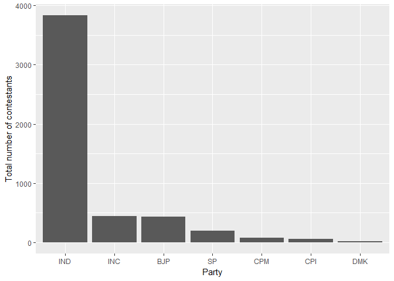
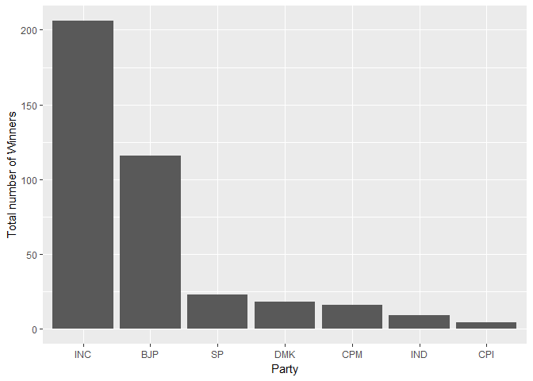
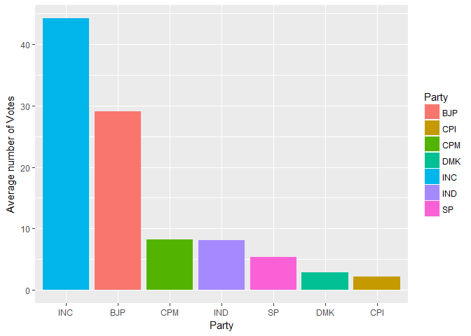
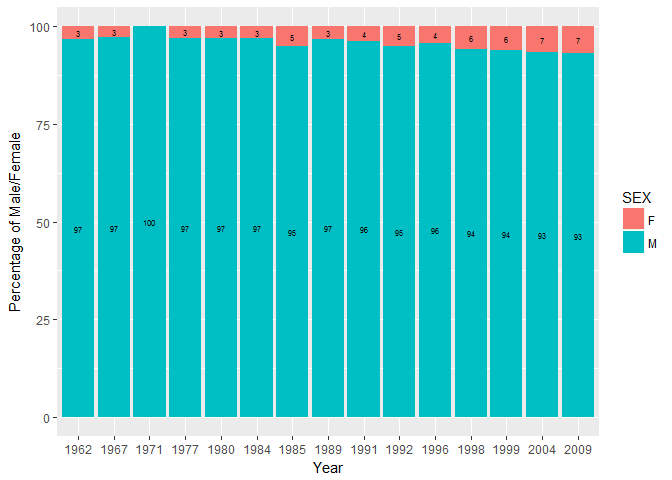
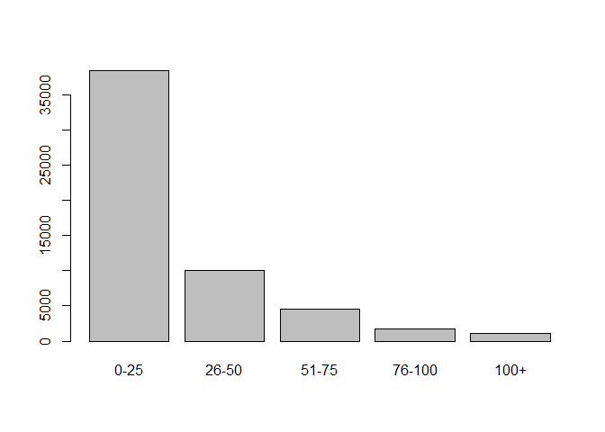
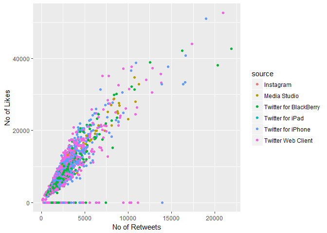

# Parliament-data-analysis---

Parliament Data analysis
================
Archit Rao
29 November 2017

1. For top ten parties compute the following metrics for the year 2009
======================================================================

``` r
parliament<-read.csv("C:/Users/Administrator/Desktop/Data visualisation/parliament.csv")

Top_Ten_Parties<-parliament%>%filter(Position==1)%>%group_by(PARTY)%>%summarise(Winners=n())%>%arrange(desc(Winners))%>%head(10)

#a) Total number of contestants

contestents<-parliament%>%filter(YEAR==2009 & PARTY %in% Top_Ten_Parties$PARTY)%>%group_by(PARTY)%>%summarise(No_of_contestants=n())%>%arrange(-No_of_contestants)

ggplot(contestents,aes(x=reorder(PARTY,-No_of_contestants),No_of_contestants))+geom_bar(stat="identity")+ xlab("Party") + ylab("Total number of contestants")
```



``` r
#b) Total of number of winning seats
Winning_Seats<-parliament%>%filter(YEAR==2009 & PARTY %in% Top_Ten_Parties$PARTY & Position==1)%>%group_by(PARTY)%>% summarise(No_of_Winners=n())%>%arrange(-No_of_Winners)

ggplot(Winning_Seats,aes(x=reorder(PARTY,-No_of_Winners),No_of_Winners))+geom_bar(stat="identity")+ xlab("Party") + ylab("Total number of Winners")
```



``` r
#c) Avg. %of votes
total_votes = parliament %>% filter(YEAR == 2009, PARTY %in% Top_Ten_Parties$PARTY) %>% summarise(tot_votes = sum(VOTES))

avgvotes = parliament %>% filter(YEAR == 2009, PARTY %in% Top_Ten_Parties$PARTY) %>% group_by(PARTY) %>% summarise(av_votes = sum(VOTES)/total_votes$tot_votes*100)

ggplot(avgvotes, aes(x = reorder(PARTY, -av_votes), y = av_votes, fill = as.factor(PARTY))) + geom_bar(stat = "identity") + scale_fill_discrete(name = "Party") + xlab("Party") + ylab("Average number of Votes")
```



``` r
#commented since they coudnt be viewedon github
#d) Identify top ten candidates with highest %margin of votes for the year 2009
#tot_votes_pc<-parliament%>%filter(YEAR==2009)%>%group_by(STATE,PC)%>%summarise(totalvotes=sum(VOTES))
#first_pos<-parliament%>%filter(YEAR==2009 & Position %in% c(1,2))%>%group_by(PC)%>%mutate(difference=c(-diff(VOTES),NA))%>%na.omit()
```

1.  Identify year wise percentage of male and female candidates? 

2.  Create a new column by binning the Runs column using the following ranges and plot the frequency count of ranges 0-25, 26-50, 51-75, 76-100, 100+

``` r
odi<-read.csv("C:/Users/Administrator/Desktop/Data visualisation/odi-batting.csv")

odi$Runs_Range<-cut(odi$Runs,breaks=c(-1,25,50,75,100,Inf),labels = c("0-25", "26-50", "51-75", "76-100","100+"))

plot(as.factor(odi$Runs_Range))
```



1.  Consider the top ten players by total runs and compute and visualize the number of centuries across years (use facet\_grid or facet\_wrap)

2.  Create a scatter plot with the following details X axis contains number of retweets Y axis contains number of likes Color represents device from which it was tweeteds 
